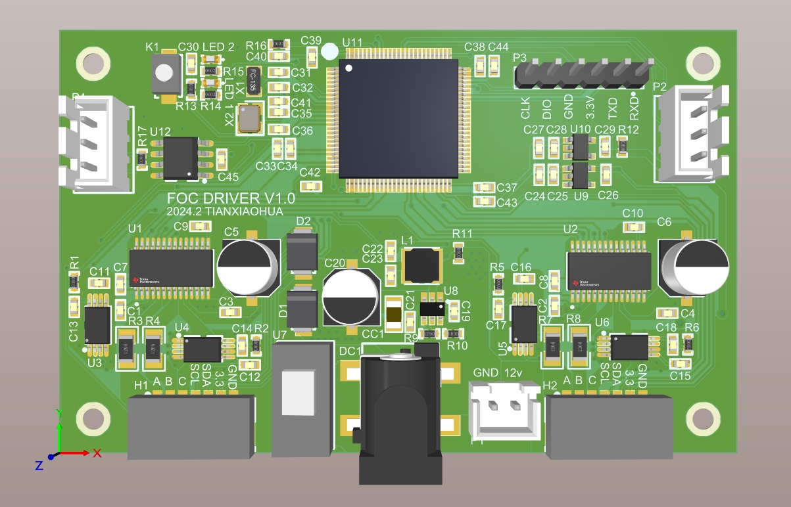
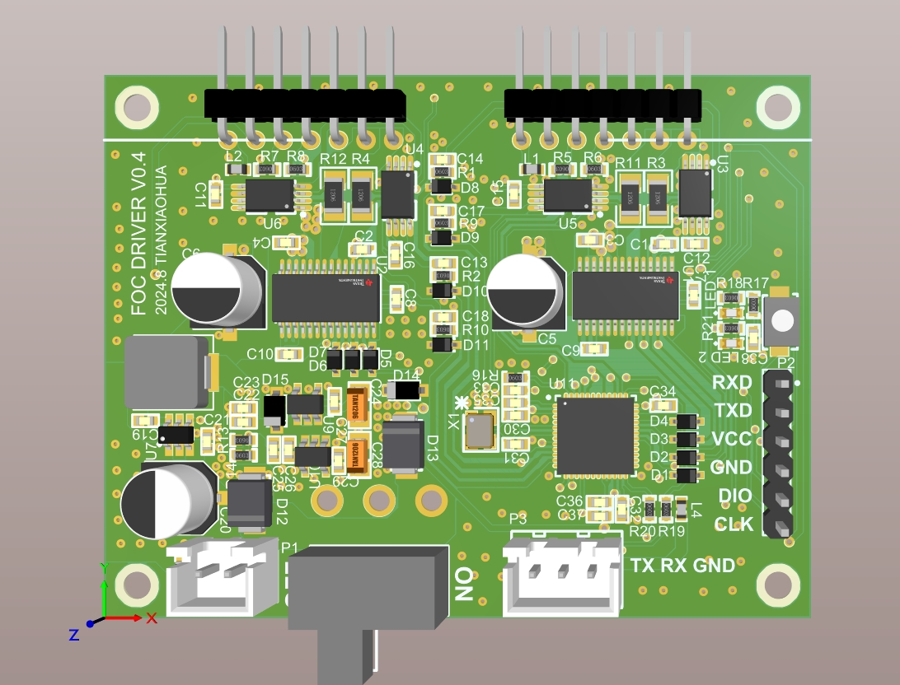

# 设计需求

1、设计一个轮足机器人；

2、机器人有车轮和一组可以活动的关节组成，分别是一对行走的轮子和用来作为关节的步进电机；

3、提供一定的续航能力，不需要太久，可以使用十分钟就可以了；

4、机器人顶部提供可以拓展的接口，可以用来控制机器人的运动；

5、机器人的内部需要具有拓展性，设计是分为FOC的轮子驱动板和负责运动部分的辅助板；

6、具备遥控的能力；

# foc HV 0.3 2024.8.25

## 设计实现

1、完成FOC驱动，可通过串口控制；

2、电源部分正常；

## 存在问题

1、单片机过大，更换小尺寸PCB和单片机，适配新的硬件结构；

2、去掉can总线驱动；

# foc HV 0.4 2024.9.1

 

## 设计实现

1、更换更稳定的外部接口，使用2.54接口适配更广

2、兼容板件连接件；

3、使用更紧凑的PCBA；

4、直接使用串口作为板间通信方案；

